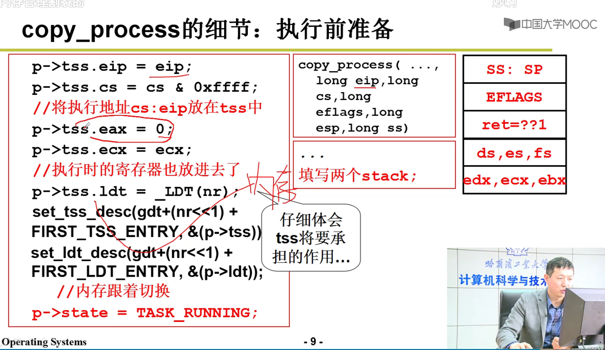
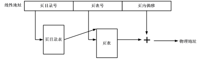
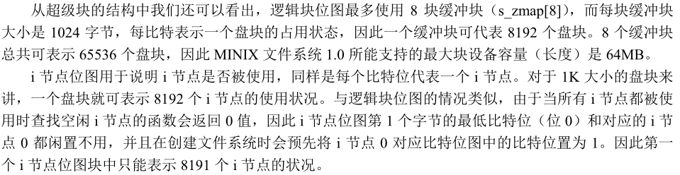

# L5 系统调用的实现

- 通过0x80中断进入内核
- 用宏实现用户空间的调用接口syscall


#  L11 内核级线程





###　实验内容：


回答下面三个题：

#### 问题 1

针对下面的代码片段：

```
movl tss,%ecx
addl $4096,%ebx
movl %ebx,ESP0(%ecx)
```

回答问题：

- （1）为什么要加 4096；

  因为一页大小4k

- （2）为什么没有设置 tss 中的 ss0。

  ​	SS0、SS1和SS2分别是0、1和2特权级的栈段选择子,用不到ss0。

#### 问题 2

针对代码片段：

```c
*(--krnstack) = ebp;
*(--krnstack) = ecx;
*(--krnstack) = ebx;
*(--krnstack) = 0;
```

回答问题：

- （1）子进程第一次执行时，eax=？为什么要等于这个数？哪里的工作让 eax 等于这样一个数？

  eax=0，因为eax是pid。copy_process()创建子进程的时候的赋值。

- （2）这段代码中的 ebx 和 ecx 来自哪里，是什么含义，为什么要通过这些代码将其写到子进程的内核栈中？

  来自父进程

- （3）这段代码中的 ebp 来自哪里，是什么含义，为什么要做这样的设置？可以不设置吗？为什么？

  ebp是用户占地址，不设置就不能运行

#### 问题 3

为什么要在切换完 LDT 之后要重新设置 fs=0x17？而且为什么重设操作要出现在切换完 LDT 之后，出现在 LDT 之前又会怎么样？

​	必须设置了ldt后，将fs显示设置一次才能保证段属性等值正确

----

### TSS切换

在现在的 Linux 0.11 中，真正完成进程切换是依靠任务状态段（Task State Segment，简称 TSS）的切换来完成的。

具体的说，在设计“Intel 架构”（即 x86 系统结构）时，每个任务（进程或线程）都对应一个独立的 TSS，TSS 就是内存中的一个结构体，里面包含了几乎所有的 CPU 寄存器的映像。有一个任务寄存器（Task Register，简称 TR）指向当前进程对应的 TSS 结构体，所谓的 TSS 切换就将 CPU 中几乎所有的寄存器都复制到 TR 指向的那个 TSS 结构体中保存起来，同时找到一个目标 TSS，即要切换到的下一个进程对应的 TSS，将其中存放的寄存器映像“扣在” CPU 上，就完成了执行现场的切换，如下图所示。


图 1 基于 TSS 的进程切换

Intel 架构不仅提供了 TSS 来实现任务切换，而且只要一条指令就能完成这样的切换，即图中的 ljmp 指令。

具体的工作过程是：

- （1）首先用 TR 中存取的段选择符在 GDT 表中找到当前 TSS 的内存位置，由于 TSS 是一个段，所以需要用段表中的一个描述符来表示这个段，和在系统启动时论述的内核代码段是一样的，那个段用 GDT 中的某个表项来描述，还记得是哪项吗？是 8 对应的第 1 项。此处的 TSS 也是用 GDT 中的某个表项描述，而 TR 寄存器是用来表示这个段用 GDT 表中的哪一项来描述，所以 TR 和 CS、DS 等寄存器的功能是完全类似的。
- （2）找到了当前的 TSS 段（就是一段内存区域）以后，将 CPU 中的寄存器映像存放到这段内存区域中，即拍了一个快照。
- （3）存放了当前进程的执行现场以后，接下来要找到目标进程的现场，并将其扣在 CPU 上，找目标 TSS 段的方法也是一样的，因为找段都要从一个描述符表中找，描述 TSS 的描述符放在 GDT 表中，所以找目标 TSS 段也要靠 GDT 表，当然只要给出目标 TSS 段对应的描述符在 GDT 表中存放的位置——段选择子就可以了，仔细想想系统启动时那条著名的 `jmpi 0, 8` 指令，这个段选择子就放在 ljmp 的参数中，实际上就 `jmpi 0, 8` 中的 8。
- （4）一旦将目标 TSS 中的全部寄存器映像扣在 CPU 上，就相当于切换到了目标进程的执行现场了，因为那里有目标进程停下时的 `CS:EIP`，所以此时就开始从目标进程停下时的那个 `CS:EIP` 处开始执行，现在目标进程就变成了当前进程，所以 TR 需要修改为目标 TSS 段在 GDT 表中的段描述符所在的位置，因为 TR 总是指向当前 TSS 段的段描述符所在的位置。

上面给出的这些工作都是一句长跳转指令 `ljmp 段选择子:段内偏移`，在段选择子指向的段描述符是 TSS 段时 CPU 解释执行的结果，所以基于 TSS 进行进程/线程切换的 `switch_to` 实际上就是一句 `ljmp` 指令：

```assembly
#define switch_to(n) {
    struct{long a,b;} tmp;
    __asm__(
        "movw %%dx,%1"
        "ljmp %0" ::"m"(*&tmp.a), "m"(*&tmp.b), "d"(TSS(n)
        
        /* tmp有64位，前32是a，后32是b。 */
        /* 把TSS(n)放到dx中。且把TSS(n)放到b的前16位 */
        /* 现在 64 位 tmp 中的内容是前 32 位为空，这个 32 位数字是段内偏移，就是 `jmpi 0, 8` 中的 0；接下来的 16 位是 `n * 16 + 4 * 8`，这个数字是段选择子，就是 `jmpi 0, 8` 中的 8，再接下来的 16 位也为空 */
    )
 }

#define FIRST_TSS_ENTRY 4

#define TSS(n) (((unsigned long) n) << 4) + (FIRST_TSS_ENTRY << 3))
  /* FIRST_TSS_ENTRY<<3 -> 4*8，即TSS在GDT表中开始的位置 */
  /* n<<4 是因为每个进程对应有一个TSS和一个LDT，即n*16 */
  /* TSS(n)即进程n的TSS位置 */
```

GDT 表的结构如下图所示，所以第一个 TSS 表项，即 0 号进程的 TSS 表项在第 4 个位置上，4<<3，即 `4 * 8`，相当于 TSS 在 GDT 表中开始的位置，TSS（n）找到的是进程 n 的 TSS 位置，所以还要再加上 n<<4，即 `n * 16`，因为每个进程对应有 1 个 TSS 和 1 个 LDT，每个描述符的长度都是 8 个字节，所以是乘以 16，其中 LDT 的作用就是上面论述的那个映射表，关于这个表的详细论述要等到内存管理一章。`TSS(n) = n * 16 + 4 * 8`，得到就是进程 n（切换到的目标进程）的 TSS 选择子，将这个值放到 dx 寄存器中，并且又放置到结构体 tmp 中 32 位长整数 b 的前 16 位，现在 64 位 tmp 中的内容是前 32 位为空，这个 32 位数字是段内偏移，就是 `jmpi 0, 8` 中的 0；接下来的 16 位是 `n * 16 + 4 * 8`，这个数字是段选择子，就是 `jmpi 0, 8` 中的 8，再接下来的 16 位也为空。所以 swith_to 的核心实际上就是 `ljmp 空, n*16+4*8`，现在和前面给出的基于 TSS 的进程切换联系在一起了。


图 2 GDT 表中的内容

### 实验内容

虽然用一条指令就能完成任务切换，但这指令的执行时间却很长，这条 ljmp 指令在实现任务切换时大概需要 200 多个时钟周期。而通过堆栈实现任务切换可能要更快，而且采用堆栈的切换还可以使用指令流水的并行优化技术，同时又使得 CPU 的设计变得简单。所以无论是 Linux 还是 Windows，进程/线程的切换都没有使用 Intel 提供的这种 TSS 切换手段，而都是通过堆栈实现的。

本次实践项目就是将 Linux 0.11 中采用的 TSS 切换部分去掉，取而代之的是基于堆栈的切换程序。具体的说，就是将 Linux 0.11 中的 switch_to 实现去掉，写成一段基于堆栈切换的代码。

在现在的 Linux 0.11 中，真正完成进程切换是依靠任务状态段（Task State Segment，简称 TSS）的切换来完成的。具体的说，在设计“Intel 架构”（即 x86 系统结构）时，每个任务（进程或线程）都对应一个独立的 TSS，TSS 就是内存中的一个结构体，里面包含了几乎所有的 CPU 寄存器的映像。有一个任务寄存器（Task Register，简称 TR）指向当前进程对应的 TSS 结构体，所谓的 TSS 切换就将 CPU 中几乎所有的寄存器都复制到 TR 指向的那个 TSS 结构体中保存起来，同时找到一个目标 TSS，即要切换到的下一个进程对应的 TSS，将其中存放的寄存器映像“扣在”CPU 上，就完成了执行现场的切换。

要实现基于内核栈的任务切换，主要完成如下三件工作：

- （1）重写 `switch_to`；
- （2）将重写的 `switch_to` 和 `schedule()` 函数接在一起；
- （3）修改现在的 `fork()`。

###　schedule 与 switch_to

目前 Linux 0.11 中工作的 schedule() 函数是首先找到下一个进程的数组位置 next，而这个 next 就是 GDT 中的 n，所以这个 next 是用来找到切换后目标 TSS 段的段描述符的，一旦获得了这个 next 值，直接调用上面剖析的那个宏展开 switch_to(next);就能完成如图 TSS 切换所示的切换了。

现在，我们不用 TSS 进行切换，而是采用切换内核栈的方式来完成进程切换，所以在新的 switch_to 中将用到当前进程的 PCB、目标进程的 PCB、当前进程的内核栈、目标进程的内核栈等信息。由于 Linux 0.11 **进程的内核栈和该进程的 PCB 在同一页内存上（一块 4KB 大小的内存）**，其中 **PCB 位于这页内存的低地址，栈位于这页内存的高地址**；另外，由于当前进程的 PCB 是用一个全局变量 current 指向的，所以只要告诉新 switch_to()函数一个指向目标进程 PCB 的指针就可以了。同时还要将 next 也传递进去，虽然 TSS(next)不再需要了，但是 LDT(next)仍然是需要的，也就是说，现在每个进程不用有自己的 TSS 了，因为已经不采用 TSS 进程切换了，但是每个进程需要有自己的 LDT，地址分离地址还是必须要有的，而进程切换必然要涉及到 LDT 的切换。

综上所述，需要将目前的 `schedule()` 函数（在 `kernal/sched.c` 中）做稍许修改，即将下面的代码：

```c
if ((*p)->state == TASK_RUNNING && (*p)->counter > c)
    c = (*p)->counter, next = i;

//......

switch_to(next);
```

修改为：

```c
if ((*p)->state == TASK_RUNNING && (*p)->counter > c)
    c = (*p)->counter, next = i, pnext = *p;

//.......

switch_to(pnext, LDT(next));
```


### 6.4 实现 switch_to

实现 `switch_to` 是本次实践项目中最重要的一部分。

由于要对内核栈进行精细的操作，所以需要用汇编代码来完成函数 `switch_to` 的编写。

这个函数依次主要完成如下功能：由于是 C 语言调用汇编，所以需要首先在汇编中处理栈帧，即处理 `ebp` 寄存器；接下来要取出表示下一个进程 PCB 的参数，并和 `current` 做一个比较，如果等于 current，则什么也不用做；如果不等于 current，就开始进程切换，依次完成 PCB 的切换、TSS 中的内核栈指针的重写、内核栈的切换、LDT 的切换以及 PC 指针（即 CS:EIP）的切换。

```assembly
.align 2  				# 字节对齐
switch_to:
    pushl %ebp			# esp 栈顶指针 ebp 栈底指针
    movl %esp,%ebp		# 将 esp 赋给 ebp 是为了方便计算偏移（因为esp会不断变化）
    pushl %ecx
    pushl %ebx
    pushl %eax			
    movl 8(%ebp),%ebx	 # ebp->下一个进程PCB的参数  8(%ebp)->ebp+8
    # ebp+8 可以取到参数1，即switch_to(pnext,_LDT(next))的pnext，详情看附1图
    cmpl %ebx,current	 
    je 1f				# je 相等即跳转
# 切换PCB
	movl %ebx,%eax
	xchgl %eax,current	# xchg 交换两个操作数的内容
	# eax 指向现在的当前进程
	# ebx 指向下一个进程，全局变量 current 也指向下一个进程
# TSS中的内核栈指针的重写
	movl tss,%ecx
	addl $4096,%ebx			# 一页有4k的大小，所以加了4k后ebx从指向下一个进程的PCB的首地址，变成了指向下一个进程的	进程页的最高地址
	movl %ebx,ESP0(%ecx)	
	# ESP0 = 4，因为 TSS 中内核栈指针 esp0 就放在偏移为 4 的地方
	
# 切换内核栈
	# KERNEL_STACK = 12	代表kernel_stack在PCB表中的偏移量
	movl %esp,KERNEL_STACK(%eax)	# eax 就是上个进程的PCB首地址，这句话是将当前的esp压入旧PCB的kernel_stack。所以这句就是保存旧进程内核栈的操作。
# 再取一下 ebx，因为前面修改过 ebx 的值
	movl 8(%ebp),%ebx
	movl KERNEL_STACK(%ebx),%esp	# esp此时是下一个进程的内核栈指针
# 切换LDT
    movl 12(%ebp),%ecx 	 # 12(%ebp)就是_LDT(next) 
    lldt %cx			# 负责修改LDTR寄存器&& ecx是32位的，cx是ecx的低16位
    # 一旦完成修改，下一个进程在执行用户态程序时使用的映射表就是自己的 LDT 表
    # 切换完 LDT 后
    movl $0x17,%ecx			# 将0x17更新给fs
    mov %cx,%fs				# 通过 fs 访问进程的用户态内存
# 和后面的 clts 配合来处理协处理器，由于和主题关系不大，此处不做论述
    cmpl %eax,last_task_used_math
    jne 1f		# jne 不相等即跳转
    clts		# clts 用于清除控制寄存器CRO中的任务已交换(TS)标志。

1:    
	popl %eax
	popl %ebx
	popl %ecx
	popl %ebp
ret
```

虽然看起来完成了挺多的切换，但实际上每个部分都只有很简单的几条指令。完成 PCB 的切换可以采用下面两条指令，其中 ebx 是从参数中取出来的下一个进程的 PCB 指针，

```
movl %ebx,%eax
xchgl %eax,current
```

经过这两条指令以后，eax 指向现在的当前进程，ebx 指向下一个进程，全局变量 current 也指向下一个进程。

TSS 中的内核栈指针的重写可以用下面三条指令完成，其中宏 `ESP0 = 4`，`struct tss_struct *tss = &(init_task.task.tss);` 也是定义了一个全局变量，和 current 类似，用来指向那一段 0 号进程的 TSS 内存。

前面已经详细论述过，在中断的时候，要找到内核栈位置，并将用户态下的 `SS:ESP`，`CS:EIP` 以及 `EFLAGS` 这五个寄存器压到内核栈中，这是沟通用户栈（用户态）和内核栈（内核态）的关键桥梁，而找到内核栈位置就依靠 TR 指向的当前 TSS。

现在虽然不使用 TSS 进行任务切换了，但是 Intel 的这态中断处理机制还要保持，所以仍然需要有一个当前 TSS，这个 TSS 就是我们定义的那个全局变量 tss，即 0 号进程的 tss，所有进程都共用这个 tss，任务切换时不再发生变化。

```
movl tss,%ecx
addl $4096,%ebx
movl %ebx,ESP0(%ecx)
```

定义 `ESP0 = 4` 是因为 TSS 中内核栈指针 esp0 就放在偏移为 4 的地方，看一看 tss 的结构体定义就明白了。

完成内核栈的切换也非常简单，和我们前面给出的论述完全一致，将寄存器 esp（内核栈使用到当前情况时的栈顶位置）的值保存到当前 PCB 中，再从下一个 PCB 中的对应位置上取出保存的内核栈栈顶放入 esp 寄存器，这样处理完以后，再使用内核栈时使用的就是下一个进程的内核栈了。

由于现在的 Linux 0.11 的 PCB 定义中没有保存内核栈指针这个域（kernelstack），所以需要加上，而宏 `KERNEL_STACK` 就是你加的那个位置，当然将 kernelstack 域加在 task_struct 中的哪个位置都可以，但是在某些汇编文件中（主要是在 `kernal/system_call.s` 中）有些关于操作这个结构一些汇编硬编码，所以一旦增加了 kernelstack，这些硬编码需要跟着修改，由于第一个位置，即 long state 出现的汇编硬编码很多，所以 kernelstack 千万不要放置在 task_struct 中的第一个位置，当放在其他位置时，修改 `kernal/system_call.s` 中的那些硬编码就可以了。

```
KERNEL_STACK = 12
movl %esp,KERNEL_STACK(%eax)
! 再取一下 ebx，因为前面修改过 ebx 的值
movl 8(%ebp),%ebx
movl KERNEL_STACK(%ebx),%esp
```

task_struct 的定义：

```c
// 在 include/linux/sched.h 中
struct task_struct {
    long state;
    long counter;
    long priority;
    long kernelstack;
//......
```

由于这里将 PCB 结构体的定义改变了，所以在产生 0 号进程的 PCB 初始化时也要跟着一起变化，需要将原来的 `#define INIT_TASK { 0,15,15, 0,{{},},0,...` 修改为 `#define INIT_TASK { 0,15,15,PAGE_SIZE+(long)&init_task, 0,{{},},0,...`，即在 PCB 的第四项中增加关于内核栈栈指针的初始化。

再下一个切换就是 LDT 的切换了，指令 `movl 12(%ebp),%ecx` 负责取出对应 LDT(next)的那个参数，指令 `lldt %cx` 负责修改 LDTR 寄存器，一旦完成了修改，下一个进程在执行用户态程序时使用的映射表就是自己的 LDT 表了，地址空间实现了分离。

最后一个切换是关于 PC 的切换，和前面论述的一致，依靠的就是 `switch_to` 的最后一句指令 ret，虽然简单，但背后发生的事却很多：`schedule()` 函数的最后调用了这个 `switch_to` 函数，所以这句指令 ret 就返回到下一个进程（目标进程）的 `schedule()` 函数的末尾，遇到的是}，继续 ret 回到调用的 `schedule()` 地方，是在中断处理中调用的，所以回到了中断处理中，就到了中断返回的地址，再调用 iret 就到了目标进程的用户态程序去执行，和书中论述的内核态线程切换的五段论是完全一致的。

这里还有一个地方需要格外注意，那就是 switch_to 代码中在切换完 LDT 后的两句，即：

```
! 切换 LDT 之后
movl $0x17,%ecx
mov %cx,%fs
```

这两句代码的含义是重新取一下段寄存器 fs 的值，这两句话必须要加、也必须要出现在切换完 LDT 之后，这是因为在实践项目 2 中曾经看到过 fs 的作用——通过 fs 访问进程的用户态内存，LDT 切换完成就意味着切换了分配给进程的用户态内存地址空间，所以前一个 fs 指向的是上一个进程的用户态内存，而现在需要执行下一个进程的用户态内存，所以就需要用这两条指令来重取 fs。

不过，细心的读者可能会发现：fs 是一个选择子，即 **fs 是一个指向描述符表项的指针**，这个描述符才是指向实际的用户态内存的指针，所以上一个进程和下一个进程的 fs 实际上都是 0x17，真正找到不同的用户态内存是因为两个进程查的 LDT 表不一样，所以这样重置一下 `fs=0x17` 有用吗，有什么用？要回答这个问题就需要对段寄存器有更深刻的认识，实际上段寄存器包含两个部分：显式部分和隐式部分，如下图给出实例所示，就是那个著名的 `jmpi 0, 8`，虽然我们的指令是让 `cs=8`，但在执行这条指令时，会在段表（GDT）中找到 8 对应的那个描述符表项，取出基地址和段限长，除了完成和 eip 的累加算出 PC 以外，还会将取出的基地址和段限长放在 cs 的隐藏部分，即图中的基地址 0 和段限长 7FF。为什么要这样做？下次执行 `jmp 100` 时，由于 cs 没有改过，仍然是 8，所以可以不再去查 GDT 表，而是直接用其隐藏部分中的基地址 0 和 100 累加直接得到 PC，增加了执行指令的效率。现在想必明白了为什么重新设置 fs=0x17 了吧？而且为什么要出现在切换完 LDT 之后？


图 3 段寄存器中的两个部分


6.4


### 6.5 修改 fork

开始修改 fork() 了，和书中论述的原理一致，就是要把进程的用户栈、用户程序和其内核栈通过压在内核栈中的 `SS:ESP`，`CS:IP` 关联在一起。

另外，由于 fork() 这个叉子的含义就是要让父子进程共用同一个代码、数据和堆栈，现在虽然是使用内核栈完成任务切换，但 fork() 的基本含义不会发生变化。

将上面两段描述联立在一起，修改 fork() 的核心工作就是要形成如下图所示的子进程内核栈结构。


图 4 fork 进程的父子进程结构

不难想象，对 fork() 的修改就是对子进程的内核栈的初始化，在 fork() 的核心实现 `copy_process` 中，`p = (struct task_struct *) get_free_page();`用来完成申请一页内存作为子进程的 PCB，而 p 指针加上页面大小就是子进程的内核栈位置，所以语句 `krnstack = (long *) (PAGE_SIZE + (long) p);` 就可以找到子进程的内核栈位置，接下来就是初始化 krnstack 中的内容了。

```c
*(--krnstack) = ss & 0xffff;
*(--krnstack) = esp;
*(--krnstack) = eflags;
*(--krnstack) = cs & 0xffff;
*(--krnstack) = eip;
```

这五条语句就完成了上图所示的那个重要的关联，因为其中 ss,esp 等内容都是 `copy_proces()` 函数的参数，这些参数来自调用 `copy_proces()` 的进程的内核栈中，就是父进程的内核栈中，所以上面给出的指令不就是将父进程内核栈中的前五个内容拷贝到子进程的内核栈中，图中所示的关联不也就是一个拷贝吗？

接下来的工作就需要和 switch_to 接在一起考虑了，故事从哪里开始呢？回顾一下前面给出来的 switch_to，应该从 “切换内核栈” 完事的那个地方开始，现在到子进程的内核栈开始工作了，接下来做的四次弹栈以及 ret 处理使用的都是子进程内核栈中的东西，

```
1: popl %eax
    popl %ebx
    popl %ecx
    popl %ebp
ret
```

为了能够顺利完成这些弹栈工作，子进程的内核栈中应该有这些内容，所以需要对 krnstack 进行初始化：

```c
*(--krnstack) = ebp;
*(--krnstack) = ecx;
*(--krnstack) = ebx;
// 这里的 0 最有意思。。对应eax，eax在系统调用入口中（unistd.h）eax是返回值,这里置0，fork（）在子进程的返回值是0
*(--krnstack) = 0;
```

现在到了 ret 指令了，这条指令要从内核栈中弹出一个 32 位数作为 EIP 跳去执行，所以需要弄一个函数地址（仍然是一段汇编程序，所以这个地址是这段汇编程序开始处的标号）并将其初始化到栈中。我们弄的一个名为 `first_return_from_kernel` 的汇编标号，然后可以用语句 `*(--krnstack) = (long) first_return_from_kernel;` 将这个地址初始化到子进程的内核栈中，现在执行 ret 以后就会跳转到 `first_return_from_kernel` 去执行了。

想一想 `first_return_from_kernel` 要完成什么工作？PCB 切换完成、内核栈切换完成、LDT 切换完成，接下来应该那个“内核级线程切换五段论”中的最后一段切换了，即完成用户栈和用户代码的切换，依靠的核心指令就是 iret，当然在切换之前应该回复一下执行现场，主要就是 `eax,ebx,ecx,edx,esi,edi,gs,fs,es,ds` 等寄存器的恢复.

下面给出了 `first_return_from_kernel` 的核心代码，当然 edx 等寄存器的值也应该先初始化到子进程内核栈，即 krnstack 中。

```
popl %edx
popl %edi
popl %esi
pop %gs
pop %fs
pop %es
pop %ds
iret
```

最后别忘了将存放在 PCB 中的内核栈指针修改到初始化完成时内核栈的栈顶，即：

```c
p->kernelstack = stack;
```


遇到的问题们：

- kernel/kernel.o：在函数‘switch_to’中：
  (.text+0xe33)：对‘tss’未定义的引用
  Makefile:67: recipe for target 'tools/system' failed

在sched.c中声明 tss

````
extern struct tss_struct *tss = &(init_task.task.tss);  /*声明tss，汇编中使用*/
````


附1


# L17

互斥进入，有空让进，有限等待。


用临界区保护信号量。

实现临界区有三种方式：面包店算法、开关中断、硬件原子指令

开关中断：关闭中断：cli()，打开中断：sti()

硬件原子指令：


# L18

死锁的四个必要条件：

- 互斥使用
- 不可抢占
- 请求和保持
- 循环等待

死锁的处理方法

- 死锁预防 

  ​	破坏死锁出现的条件

- 死锁避免 

  ​	检测每个资源请求，如果造成死锁就拒绝

- 死锁检测+恢复

  ​	检测到死锁后，让一些进程让出资源

- 死锁忽略

  ​	忽略	

# L23


子进程和父进程共用页，所以不用新分配内存，只要在虚拟地址进行页表的拷贝就可以了。


子进程读的时候和父进程共用物理内存中的同一页（之前设置成了只读）。写的时候才复制出一个子进程自己的页进程修改，实现了读写分离。


# L24


# Lab 7 地址映射与共享


## 3. 实验内容

本次实验的基本内容是：

-   用 Bochs 调试工具跟踪 Linux 0.11 的地址翻译（地址映射）过程，了解 IA-32 和 Linux 0.11 的内存管理机制；
-   在 Ubuntu 上编写多进程的生产者—消费者程序，用共享内存做缓冲区；
-   在信号量实验的基础上，为 Linux 0.11 增加共享内存功能，并将生产者—消费者程序移植到 Linux 0.11。

#### 3.1 跟踪地址翻译过程

首先以汇编级调试的方式启动 Bochs，引导 Linux 0.11，在 0.11 下编译和运行 test.c。它是一个无限循环的程序，永远不会主动退出。然后在调试器中通过查看各项系统参数，从逻辑地址、LDT 表、GDT 表、线性地址到页表，计算出变量 `i` 的物理地址。最后通过直接修改物理内存的方式让 test.c 退出运行。

test.c 的代码如下：

```
#include <stdio.h>

int i = 0x12345678;
int main(void)
{
    printf("The logical/virtual address of i is 0x%08x", &i);
    fflush(stdout);
    while (i)
        ;
    return 0;
}
```

#### 3.2 基于共享内存的生产者—消费者程序

本项实验在 Ubuntu 下完成，与信号量实验中的 `pc.c` 的功能要求基本一致，仅有两点不同：

-   不用文件做缓冲区，而是使用共享内存；
-   生产者和消费者分别是不同的程序。生产者是 producer.c，消费者是 consumer.c。两个程序都是单进程的，通过信号量和缓冲区进行通信。

Linux 下，可以通过 `shmget()` 和 `shmat()` 两个系统调用使用共享内存。

#### 3.3 共享内存的实现

进程之间可以通过页共享进行通信，被共享的页叫做共享内存，结构如下图所示：


图 1 进程间共享内存的结构

本部分实验内容是在 Linux 0.11 上实现上述页面共享，并将上一部分实现的 producer.c 和 consumer.c 移植过来，验证页面共享的有效性。

具体要求在 `mm/shm.c` 中实现 `shmget()` 和 `shmat()` 两个系统调用。它们能支持 `producer.c` 和 `consumer.c` 的运行即可，不需要完整地实现 POSIX 所规定的功能。

-   shmget()

```c
int shmget(key_t key, size_t size, int shmflg);
```

`shmget()` 会新建/打开一页内存，并返回该页共享内存的 shmid（该块共享内存在操作系统内部的 id）。

所有使用同一块共享内存的进程都要使用相同的 key 参数。

如果 key 所对应的共享内存已经建立，则直接返回 `shmid`。如果 size 超过一页内存的大小，返回 `-1`，并置 `errno` 为 `EINVAL`。如果系统无空闲内存，返回 -1，并置 `errno` 为 `ENOMEM`。

`shmflg` 参数可忽略。

-   shmat()

```c
void *shmat(int shmid, const void *shmaddr, int shmflg);
```

`shmat()` 会将 `shmid` 指定的共享页面映射到当前进程的虚拟地址空间中，并将其首地址返回。

如果 `shmid` 非法，返回 `-1`，并置 `errno` 为 `EINVAL`。

`shmaddr` 和 `shmflg` 参数可忽略。

## 4. 实验报告

完成实验后，在实验报告中回答如下问题：

-   对于地址映射实验部分，列出你认为最重要的那几步（不超过 4 步），并给出你获得的实验数据。
-   test.c 退出后，如果马上再运行一次，并再进行地址跟踪，你发现有哪些异同？为什么？

## 6. 实验提示

本次需要完成的内容：

-   （1）用 Bochs 调试工具跟踪 Linux 0.11 的地址翻译（地址映射）过程，了解 IA-32 和 Linux 0.11 的内存管理机制；
-   （2）在 Ubuntu 上编写多进程的生产者—消费者程序，用共享内存做缓冲区；
-   （3）在信号量实验的基础上，为 Linux 0.11 增加共享内存功能，并将生产者—消费者程序移植到 Linux 0.11。

### 6.1 IA-32 的地址翻译过程

Linux 0.11 完全遵循 IA-32（Intel Architecture 32-bit）架构进行地址翻译，Windows、后续版本的 Linux 以及一切在 IA-32 保护模式下运行的操作系统都遵循此架构。因为只有这样才能充分发挥 CPU 的 `MMU`（内存管理单元） 的功能。

关于此地址翻译过程的细节，请参考《注释》一书中的 5.3.1-5.3.4 节。

### 6.2 用 Bochs 汇编级调试功能进行人工地址翻译

此过程比较机械，基本不消耗脑细胞，做一下有很多好处。

#### （1）准备

编译好 Linux 0.11 后，首先通过运行 `./dbg-asm` 启动调试器，此时 Bochs 的窗口处于黑屏状态


而命令行窗口显示：


```txt
========================================================================
                       Bochs x86 Emulator 2.3.7
               Build from CVS snapshot, on June 3, 2008
========================================================================
00000000000i[     ] reading configuration from ./bochs/bochsrc.bxrc
00000000000i[     ] installing x module as the Bochs GUI
00000000000i[     ] using log file ./bochsout.txt
Next at t=0
(0) [0xfffffff0] f000:fff0 (unk. ctxt): jmp far f000:e05b         ; ea5be000f0
<bochs:1>_
```

`Next at t=0` 表示下面的指令是 Bochs 启动后要执行的第一条软件指令。

单步跟踪进去就能看到 BIOS 的代码。不过这不是本实验需要的。直接输入命令 `c`，continue 程序的运行，Bochs 一如既往地启动了 Linux 0.11。

在 Linux 0.11 下输入（或拷入）test.c（代码在本实验的第 3 小节中），编译为 test，运行之，打印如下信息：

```txt
The logical/virtual address of i is 0x00003004
```

只要 test 不变，`0x00003004` 这个值在任何人的机器上都是一样的。即使在同一个机器上多次运行 test，也是一样的。

test 是一个死循环，只会不停占用 CPU，不会退出。

>   

#### （2）暂停

当 test 运行的时候，在命令行窗口按 `Ctrl+c`，Bochs 会暂停运行，进入调试状态。绝大多数情况下都会停在 test 内，显示类似如下信息：

```txt
(0) [0x00fc8031] 000f:00000031 (unk. ctxt): cmp dword ptr ds:0x3004, 0x00000000 ; 833d0430000000
```

其中的 `000f` 如果是 `0008`，则说明中断在了内核里。那么就要 `c`，然后再 `ctrl+c`，直到变为 `000f` 为止。

如果显示的下一条指令不是 `cmp ...`（这里指语句以 `cmp` 开头），就用 `n` 命令单步运行几步，直到停在 `cmp ...`。

>   

使用命令 `u /8`，显示从当前位置开始 8 条指令的反汇编代码，结构如下：


```txt
<bochs:3> u /8
10000063: (                    ): cmp dword ptr ds:0x3004, 0x00000000 ; 833d0430000000
1000006a: (                    ): jz .+0x00000004           ; 7404
1000006c: (                    ): jmp .+0xfffffff5          ; ebf5
1000006e: (                    ): add byte ptr ds:[eax], al ; 0000
10000070: (                    ): xor eax, eax              ; 31c0
10000072: (                    ): jmp .+0x00000000          ; eb00
10000074: (                    ): leave                     ; c9
10000075: (                    ): ret                       ; c3
```

这就是 test.c 中从 while 开始一直到 return 的汇编代码。变量 i 保存在 `ds:0x3004` 这个地址，并不停地和 0 进行比较，直到它为 0，才会跳出循环。

现在，开始寻找 `ds:0x3004` 对应的物理地址。

>   


### 6.3 段表

`ds:0x3004` 是虚拟地址，ds 表明这个地址属于 ds 段。首先要找到段表，然后通过 ds 的值在段表中找到 ds 段的具体信息，才能继续进行地址翻译。

每个在 IA-32 上运行的应用程序都有一个段表，叫 LDT，段的信息叫段描述符。

LDT 在哪里呢？ldtr 寄存器是线索的起点，通过它可以在 GDT（全局描述符表）中找到 LDT 的物理地址。

用 `sreg` 命令（是在调试窗口输入）：

```txt
<bochs:4> sreg
cs:s=0x000f, dl=0x00000002, dh=0x10c0fa00, valid=1
ds:s=0x0017, dl=0x00003fff, dh=0x10c0f300, valid=3
ss:s=0x0017, dl=0x00003fff, dh=0x10c0f300, valid=1
es:s=0x0017, dl=0x00003fff, dh=0x10c0f300, valid=1
fs:s=0x0017, dl=0x00003fff, dh=0x10c0f300, valid=1
gs:s=0x0017, dl=0x00003fff, dh=0x10c0f300, valid=1
ldtr:s=0x0068, dl=0xa2d00068, dh=0x000082fa, valid=1
tr:s=0x0060, dl=0xa2e80068, dh=0x00008bfa, valid=1
gdtr:base=0x00005cb8, limit=0x7ff
idtr:base=0x000054b8, limit=0x7ff
```

可以看到 ldtr 的值是 `0x0068=0000000001101000`（二进制），表示 LDT 表存放在 GDT 表的 1101（二进制）=13（十进制）号位置（每位数据的意义参考后文叙述的段选择子）。

>   

而 GDT 的位置已经由 gdtr 明确给出，在物理地址的 `0x00005cb8`。

用 `xp /32w 0x00005cb8` 查看从该地址开始，32 个字的内容，及 GDT 表的前 16 项，如下：

```txt
<bochs:5> xp /32w 0x00005cb8
[bochs]:
0x00005cb8 <bogus+       0>:    0x00000000    0x00000000    0x00000fff    0x00c09a00
0x00005cc8 <bogus+      16>:    0x00000fff    0x00c09300    0x00000000    0x00000000
0x00005cd8 <bogus+      32>:    0xa4280068    0x00008901    0xa4100068    0x00008201
0x00005ce8 <bogus+      48>:    0xf2e80068    0x000089ff    0xf2d00068    0x000082ff
0x00005cf8 <bogus+      64>:    0xd2e80068    0x000089ff    0xd2d00068    0x000082ff
0x00005d08 <bogus+      80>:    0x12e80068    0x000089fc    0x12d00068    0x000082fc
0x00005d18 <bogus+      96>:    0xa2e80068    0x00008bfa    0xa2d00068    0x000082fa
0x00005d28 <bogus+     112>:    0xc2e80068    0x000089f8    0xc2d00068    0x000082f8
```

>   

GDT 表中的每一项占 64 位（8 个字节），所以我们要查找的项的地址是 `0x00005cb8+13*8`。

输入 `xp /2w 0x00005cb8+13*8`，得到：

```txt
<bochs:6> xp /2w 0x00005cb8+13*8
[bochs]:
0x00005d20 <bogus+       0>:    0xa2d00068    0x000082fa
```

上两步看到的数值可能和这里给出的示例不一致，这是很正常的。如果想确认是否准确，就看 `sreg` 输出中，ldtr 所在行里，`dl` 和 `dh` 的值，它们是 Bochs 的调试器自动计算出的，你寻找到的必须和它们一致。

>   
>
>   组合后为0x00fa62d0，即LDT表的物理地址。

“0x**a2d0**0068 0x000082**fa**” 将其中的加粗数字组合为“0x00faa2d0”，这就是 LDT 表的物理地址（为什么这么组合，参考后文介绍的段描述符）。

`xp /8w 0x00faa2d0`，得到：

```txt
<bochs:7> xp /8w 0x00faa2d0
[bochs]:
0x00faa2d0 <bogus+       0>:    0x00000000    0x00000000    0x00000002    0x10c0fa00
0x00faa2e0 <bogus+      16>:    0x00003fff    0x10c0f300    0x00000000    0x00fab000
```

这就是 LDT 表的前 4 项内容了。

>   

### 6.4 段描述符

在保护模式下，段寄存器有另一个名字，叫段选择子，因为它保存的信息主要是该段在段表里索引值，用这个索引值可以从段表中“选择”出相应的段描述符。

先看看 ds 选择子的内容，还是用 `sreg` 命令：

```txt
<bochs:8> sreg
cs:s=0x000f, dl=0x00000002, dh=0x10c0fa00, valid=1
ds:s=0x0017, dl=0x00003fff, dh=0x10c0f300, valid=3
ss:s=0x0017, dl=0x00003fff, dh=0x10c0f300, valid=1
es:s=0x0017, dl=0x00003fff, dh=0x10c0f300, valid=1
fs:s=0x0017, dl=0x00003fff, dh=0x10c0f300, valid=1
gs:s=0x0017, dl=0x00003fff, dh=0x10c0f300, valid=1
ldtr:s=0x0068, dl=0xa2d00068, dh=0x000082fa, valid=1
tr:s=0x0060, dl=0xa2e80068, dh=0x00008bfa, valid=1
gdtr:base=0x00005cb8, limit=0x7ff
idtr:base=0x000054b8, limit=0x7ff
```

可以看到，ds 的值是 `0x0017`。段选择子是一个 16 位寄存器，它各位的含义如下图：


图 2 段选择子的结构

其中 RPL 是请求特权级，当访问一个段时，处理器要检查 RPL 和 CPL（放在 cs 的位 0 和位 1 中，用来表示当前代码的特权级），即使程序有足够的特权级（CPL）来访问一个段，但如果 RPL（如放在 ds 中，表示请求数据段）的特权级不足，则仍然不能访问，即如果 RPL 的数值大于 CPL（数值越大，权限越小），则用 RPL 的值覆盖 CPL 的值。

而段选择子中的 TI 是表指示标记，如果 TI=0，则表示段描述符（段的详细信息）在 GDT（全局描述符表）中，即去 GDT 中去查；而 TI=1，则去 LDT（局部描述符表）中去查。

看看上面的 ds，`0x0017=0000000000010111`（二进制），所以 RPL=11，可见是在最低的特权级（因为在应用程序中执行），TI=1，表示查找 LDT 表，索引值为 10（二进制）= 2（十进制），表示找 LDT 表中的第 3 个段描述符（从 0 开始编号）。

LDT 和 GDT 的结构一样，每项占 8 个字节。所以第 3 项 `0x00003fff 0x10c0f300`（上一步骤的最后一个输出结果中） 就是搜寻好久的 ds 的段描述符了。

用 `sreg` 输出中 ds 所在行的 dl 和 dh 值可以验证找到的描述符是否正确。

接下来看看段描述符里面放置的是什么内容：


图 3 段描述符的结构

可以看到，段描述符是一个 64 位二进制的数，存放了段基址和段限长等重要的数据。其中位 P（Present）是段是否存在的标记；位 S 用来表示是系统段描述符（S=0）还是代码或数据段描述符（S=1）；四位 TYPE 用来表示段的类型，如数据段、代码段、可读、可写等；DPL 是段的权限，和 CPL、RPL 对应使用；位 G 是粒度，G=0 表示段限长以位为单位，G=1 表示段限长以 4KB 为单位；其他内容就不详细解释了。

### 6.5 段基址和线性地址

费了很大的劲，实际上我们需要的只有段基址一项数据，即段描述符 “0x**0000**3fff 0x**10**c0f3**00**” 中加粗部分组合成的 “0x10000000”。这就是 ds 段在线性地址空间中的起始地址。用同样的方法也可以算算其它段的基址，都是这个数。

段基址+段内偏移，就是线性地址了。所以 ds:0x3004 的线性地址就是：

```txt
0x10000000 + 0x3004 = 0x10003004
```

用 `calc ds:0x3004` 命令可以验证这个结果。

>   

### 6.6 页表

从线性地址计算物理地址，需要查找页表。线性地址变成物理地址的过程如下：



图 4 页表工作原理

线性地址变成物理地址

首先需要算出线性地址中的页目录号、页表号和页内偏移，它们分别对应了 32 位线性地址的 10 位 + 10 位 + 12 位，所以 0x10003004 的页目录号是 64，页号 3，页内偏移是 4。

IA-32 下，页目录表的位置由 CR3 寄存器指引。“creg”命令可以看到：

```txt
CR0=0x8000001b: PG cd nw ac wp ne ET TS em MP PE
CR2=page fault laddr=0x10002f68
CR3=0x00000000
    PCD=page-level cache disable=0
    PWT=page-level writes transparent=0
CR4=0x00000000: osxmmexcpt osfxsr pce pge mce pae pse de tsd pvi vme
```

>   

说明页目录表的基址为 0。看看其内容，“xp /68w 0”：

```txt
0x00000000 :    0x00001027    0x00002007    0x00003007    0x00004027
0x00000010 :    0x00000000    0x00024764    0x00000000    0x00000000
0x00000020 :    0x00000000    0x00000000    0x00000000    0x00000000
0x00000030 :    0x00000000    0x00000000    0x00000000    0x00000000
0x00000040 :    0x00ffe027    0x00000000    0x00000000    0x00000000
0x00000050 :    0x00000000    0x00000000    0x00000000    0x00000000
0x00000060 :    0x00000000    0x00000000    0x00000000    0x00000000
0x00000070 :    0x00000000    0x00000000    0x00000000    0x00000000
0x00000080 :    0x00ff3027    0x00000000    0x00000000    0x00000000
0x00000090 :    0x00000000    0x00000000    0x00000000    0x00000000
0x000000a0 :    0x00000000    0x00000000    0x00000000    0x00000000
0x000000b0 :    0x00000000    0x00000000    0x00000000    0x00ffb027
0x000000c0 :    0x00ff6027    0x00000000    0x00000000    0x00000000
0x000000d0 :    0x00000000    0x00000000    0x00000000    0x00000000
0x000000e0 :    0x00000000    0x00000000    0x00000000    0x00000000
0x000000f0 :    0x00000000    0x00000000    0x00000000    0x00ffa027
0x00000100 :    0x00faa027    0x00000000    0x00000000    0x00000000
```

>   

页目录表和页表中的内容很简单，是 1024 个 32 位（正好是 4K）数。这 32 位中前 20 位是物理页框号，后面是一些属性信息（其中最重要的是最后一位 P）。其中第 65 个页目录项就是我们要找的内容，用“xp /w 0+64*4”查看：

```txt
0x00000100 :    0x00faa027
```

>   
>
>   
>
>   027是属性，即页表所在页框号是0x00fa1000。

其中的 027 是属性，显然 P=1，其他属性实验者自己分析吧。页表所在物理页框号为 0x00faa，即页表在物理内存的 0x00faa000 位置。从该位置开始查找 3 号页表项，得到（xp /w 0x00faa000+3*4）：

```txt
0x00faa00c :    0x00fa7067
```

其中 067 是属性，显然 P=1，应该是这样。

>   
>
>   067是属性，即对应的页框号为0x00f9d000.

### 6.7 物理地址

最终结果马上就要出现了！

线性地址 0x10003004 对应的物理页框号为 0x00fa7，和页内偏移 0x004 接到一起，得到 0x00fa7004，这就是变量 i 的物理地址。可以通过两种方法验证。

>   得到0x00f9d004

第一种方法是用命令 `page 0x10003004`，可以得到信息：

```txt
linear page 0x10003000 maps to physical page 0x00fa7000
```

>   

第二种方法是用命令 `xp /w 0x00fa7004`，可以看到：

```txt
0x00fa7004 :    0x12345678
```

>   

这个数值确实是 test.c 中 i 的初值。

现在，通过直接修改内存来改变 i 的值为 0，命令是： setpmem 0x00fa7004 4 0，表示从 0x00fa7004 地址开始的 4 个字节都设为 0。然后再用“c”命令继续 Bochs 的运行，可以看到 test 退出了，说明 i 的修改成功了，此项实验结束。

>   
>
>   
>
>   确实退出了。


### 6.8 在 Linux 0.11 中实现共享内存

#### （1）Linux 中的共享内存

Linux 支持两种方式的共享内存。一种方式是 `shm_open()`、`mmap()` 和 `shm_unlink()` 的组合；另一种方式是 `shmget()`、`shmat()` 和 `shmdt()` 的组合。本实验建议使用后一种方式。

这些系统调用的详情，请查阅 man 及相关资料。

特别提醒：没有父子关系的进程之间进行共享内存，`shmget()` 的第一个参数 key 不要用 `IPC_PRIVATE`，否则无法共享。用什么数字可视心情而定。

#### （2）获得空闲物理页面

实验者需要考虑如何实现页面共享。首先看一下 Linux 0.11 如何操作页面，如何管理进程地址空间。

在 `kernel/fork.c` 文件中有：

```c
int copy_process(…)
{
    struct task_struct *p;
    p = (struct task_struct *) get_free_page();
    if (!p)
        return -EAGAIN;
//    ……
}
```

函数 `get_free_page()` 用来获得一个空闲物理页面，在 `mm/memory.c` 文件中：

```c
unsigned long get_free_page(void)
{
    register unsigned long __res asm("ax");
    __asm__("std ; repne ; scasb\n\t"
            "jne 1f\n\t"
            "movb $1,1(%%edi)\n\t"
            // 页面数*4KB=相对页面起始地址
            "sall $12,%%ecx\n\t"
            // 在加上低端的内存地址，得到的是物理起始地址
            "addl %2,%%ecx\n\t"
            "movl %%ecx,%%edx\n\t"
            "movl $1024,%%ecx\n\t"
            "leal 4092(%%edx),%%edi\n\t"
            "rep ; stosl\n\t"
            //edx赋给eax，eax返回了物理起始地址
            "movl %%edx,%%eax\n"
            "1:" :"=a" (__res) :"0" (0),"i" (LOW_MEM),"c" (PAGING_PAGES),
            "D" (mem_map+PAGING_PAGES-1):"di","cx","dx");
    return __res;
}

static unsigned char mem_map [ PAGING_PAGES ] = {0,};
```

显然 `get_free_page` 函数就是在 `mem_map` 位图中寻找值为 0 的项（空闲页面），该函数返回的是该页面的起始物理地址。

#### （3）地址映射

有了空闲的物理页面，接下来需要完成线性地址和物理页面的映射，Linux 0.11 中也有这样的代码，看看 `mm/memory.c` 中的 `do_no_page(unsigned long address)`，该函数用来处理线性地址 address 对应的物理页面无效的情况（即缺页中断），`do_no_page` 函数中调用一个重要的函数 `get_empty_page(address)`，其中有：

```c
// 函数 get_empty_page(address)

unsigned long tmp=get_free_page();
// 建立线性地址和物理地址的映射
put_page(tmp, address);
```

显然这两条语句就用来获得空闲物理页面，然后填写线性地址 address 对应的页目录和页表。

#### （4）	

有了空闲物理页面，也有了建立线性地址和物理页面的映射，但要完成本实验还需要能获得一段空闲的虚拟地址空闲。

要从数据段中划出一段空间，首先需要了解进程数据段空间的分布，而这个分布显然是由 exec 系统调用决定的，所以要详细看一看 exec 的核心代码，`do_execve`（在文件 `fs/exec.c` 中）。

在函数 `do_execve()` 中，修改数据段（当然是修改 LDT）的地方是 `change_ldt`，函数 change_ldt 实现如下：

```c
static unsigned long change_ldt(unsigned long text_size,unsigned long * page)
{
    /*其中text_size是代码段长度，从可执行文件的头部取出，page为参数和环境页*/
    unsigned long code_limit,data_limit,code_base,data_base;
    int i;

    code_limit = text_size+PAGE_SIZE -1;
    code_limit &= 0xFFFFF000;
    //code_limit为代码段限长=text_size对应的页数（向上取整）
    data_limit = 0x4000000; //数据段限长64MB
    code_base = get_base(current->ldt[1]);
    data_base = code_base;

    // 数据段基址 = 代码段基址
    set_base(current->ldt[1],code_base);
    set_limit(current->ldt[1],code_limit);
    set_base(current->ldt[2],data_base);
    set_limit(current->ldt[2],data_limit);
    __asm__("pushl $0x17\n\tpop %%fs":: );

    // 从数据段的末尾开始
    data_base += data_limit;

    // 向前处理
    for (i=MAX_ARG_PAGES-1 ; i>=0 ; i--) {
        // 一次处理一页
        data_base -= PAGE_SIZE;
        // 建立线性地址到物理页的映射
        if (page[i]) put_page(page[i],data_base);
    }
    // 返回段界限
    return data_limit;
}
```

仔细分析过函数 `change_ldt`，想必实验者已经知道该如何从数据段中找到一页空闲的线性地址。《注释》中的图 13-6 也能给你很大帮助。

### 6.9 在同一终端中同时运行两个程序

Linux 的 shell 有后台运行程序的功能。只要在命令的最后输入一个 `&`，命令就会进入后台运行，前台马上回到提示符，进而能运行下一个命令，例如：

```bash
$ sudo ./producer &
$ sudo ./consumer
```

当运行 `./consumer` 的时候，producer 正在后台运行。


# L26 IO与显示器

-   形成文件视图
-   发出out指令
-   形成中断处理


# Lab 8 终端设备的控制

## 2. 实验目的

-   加深对操作系统设备管理基本原理的认识，实践键盘中断、扫描码等概念；
-   通过实践掌握 Linux 0.11 对键盘终端和显示器终端的处理过程。

## 3. 实验内容

本实验的基本内容是修改 Linux 0.11 的终端设备处理代码，对键盘输入和字符显示进行非常规的控制。

在初始状态，一切如常。用户按一次 F12 后，把应用程序向终端输出所有字母都替换为“*”。用户再按一次 F12，又恢复正常。第三次按 F12，再进行输出替换。依此类推。

以 ls 命令为例：

正常情况：

```bash
# ls
hello.c hello.o hello
```

第一次按 F12，然后输入 ls：

```bash
# **
*****.* *****.* *****
```

第二次按 F12，然后输入 ls：

```bash
# ls
hello.c hello.o hello
```

第三次按 F12，然后输入 ls：

```bash
# **
*****.* *****.* *****
```

## 4. 实验报告

完成实验后，在实验报告中回答如下问题：

-   在原始代码中，按下 F12，中断响应后，中断服务程序会调用 func？它实现的是什么功能？

    >   调用put_queue

-   在你的实现中，是否把向文件输出的字符也过滤了？如果是，那么怎么能只过滤向终端输出的字符？如果不是，那么怎么能把向文件输出的字符也一并进行过滤？

    >   过滤向文件输出的字符需要修改file_write

## 6. 实验提示

本实验需要修改 Linux 0.11 的终端设备处理代码（`kernel/chr_drv/console.c` 文件），对键盘输入和字符显示进行非常规的控制。

### 6.1 键盘输入处理过程

键盘 I/O 是典型的中断驱动，在 `kernel/chr_drv/console.c` 文件中：

```c
void con_init(void)  //控制台的初始化
{
    // 键盘中断响应函数设为 keyboard_interrupt
    set_trap_gate(0x21, &keyboard_interrupt);
}
```

所以每次按键有动作，keyboard_interrupt 函数就会被调用，它在文件 `kernel/chr_drv/keyboard.S`（注意，扩展名是大写的 S）中实现。

所有与键盘输入相关的功能都是在此文件中实现的，所以本实验的部分功能也可以在此文件中实现。

简单说，`keyboard_interrupt` 被调用后，会将键盘扫描码做为下标，调用数组 `key_table` 保存的与该按键对应的响应函数。

### 6.2 输出字符的控制

`printf()` 等输出函数最终都是调用 `write()` 系统调用，所以控制好 `write()`，就能控制好输出字符。

>   


# L28


所以为了节省磁盘访问时间，应该尽量减少寻道时间。


# L30


根据读写的位置（字符流位置）除以块的大小就算出来字符流在哪一段。根据段查映射表就可以找到对应的盘块号。再用bread根据盘块号发出磁盘读写。

-   从文件名找到inode
-   根据inode找到盘块号
-   盘块号往电梯队列中放
-   根据盘块号算出C、H、S
-   根据out发到磁盘控制器
-   驱动马达形成数据


# Lab 9

## 2. 实验目的

-   掌握虚拟文件系统的实现原理；
-   实践文件、目录、文件系统等概念。

## 3. 实验内容

在 Linux 0.11 上实现 procfs（proc 文件系统）内的 psinfo 结点。当读取此结点的内容时，可得到系统当前所有进程的状态信息。例如，用 cat 命令显示 `/proc/psinfo` 的内容，可得到：

```bash
$ cat /proc/psinfo
pid    state    father    counter    start_time
0    1    -1    0    0
1    1    0    28    1
4    1    1    1    73
3    1    1    27    63
6    0    4    12    817
$ cat /proc/hdinfo
total_blocks:    62000;
free_blocks:    39037;
used_blocks:    22963;
...
```

`procfs` 及其结点要在内核启动时自动创建。

相关功能实现在 `fs/proc.c` 文件内。

## 4. 实验报告

完成实验后，在实验报告中回答如下问题：

-   如果要求你在 `psinfo` 之外再实现另一个结点，具体内容自选，那么你会实现一个给出什么信息的结点？为什么？
-   一次 `read()` 未必能读出所有的数据，需要继续 `read()`，直到把数据读空为止。而数次 `read()` 之间，进程的状态可能会发生变化。你认为后几次 `read()` 传给用户的数据，应该是变化后的，还是变化前的？ + 如果是变化后的，那么用户得到的数据衔接部分是否会有混乱？如何防止混乱？ + 如果是变化前的，那么该在什么样的情况下更新 `psinfo` 的内容？

## 6. 实验提示

本实验文档在 Linux 0.11 上实现 `procfs`（proc 文件系统）内的 `psinfo` 结点。当读取 `psinfo` 结点的内容时，可得到系统当前所有进程的状态信息。

最后还给出来 `hdinfo` 结点实现的提示。

### 6.1 procfs 简介

正式的 Linux 内核实现了 `procfs`，它是一个虚拟文件系统，通常被 mount（挂载） 到 `/proc` 目录上，通过虚拟文件和虚拟目录的方式提供访问系统参数的机会，所以有人称它为 “了解系统信息的一个窗口”。

这些虚拟的文件和目录并没有真实地存在在磁盘上，而是内核中各种数据的一种直观表示。虽然是虚拟的，但它们都可以通过标准的系统调用（`open()`、`read()` 等）访问。

例如，`/proc/meminfo` 中包含内存使用的信息，可以用 cat 命令显示其内容：

```bash
$ cat /proc/meminfo
MemTotal:       384780 kB
MemFree:         13636 kB
Buffers:         13928 kB
Cached:         101680 kB
SwapCached:        132 kB
Active:         207764 kB
Inactive:        45720 kB
SwapTotal:      329324 kB
SwapFree:       329192 kB
Dirty:               0 kB
Writeback:           0 kB
……
```

其实，Linux 的很多系统命令就是通过读取 `/proc` 实现的。例如 `uname -a` 的部分信息就来自 `/proc/version`，而 `uptime` 的部分信息来自 `/proc/uptime` 和 `/proc/loadavg`。

关于 procfs 更多的信息请访问：http://en.wikipedia.org/wiki/Procfs

### 6.2 基本思路

Linux 是通过文件系统接口实现 `procfs`，并在启动时自动将其 mount 到 `/proc` 目录上。

此目录下的所有内容都是随着系统的运行自动建立、删除和更新的，而且它们完全存在于内存中，不占用任何外存空间。

Linux 0.11 还没有实现虚拟文件系统，也就是，还没有提供增加新文件系统支持的接口。所以本实验只能在现有文件系统的基础上，通过打补丁的方式模拟一个 `procfs`。

Linux 0.11 使用的是 Minix 的文件系统，这是一个典型的基于 `inode` 的文件系统，《注释》一书对它有详细描述。它的每个文件都要对应至少一个 inode，而 inode 中记录着文件的各种属性，包括文件类型。文件类型有普通文件、目录、字符设备文件和块设备文件等。在内核中，每种类型的文件都有不同的处理函数与之对应。我们可以增加一种新的文件类型——proc 文件，并在相应的处理函数内实现 procfs 要实现的功能。

### 6.3 增加新文件类型

在 `include/sys/stat.h` 文件中定义了几种文件类型和相应的测试宏：

```c
#define S_IFMT  00170000

// 普通文件
#define S_IFREG  0100000

// 块设备
#define S_IFBLK  0060000

// 目录
#define S_IFDIR  0040000

// 字符设备
#define S_IFCHR  0020000
#define S_IFIFO  0010000
//……

// 测试 m 是否是普通文件
#define S_ISREG(m)      (((m) & S_IFMT) == S_IFREG)

// 测试 m 是否是目录
#define S_ISDIR(m)      (((m) & S_IFMT) == S_IFDIR)

// 测试 m 是否是字符设备
#define S_ISCHR(m)      (((m) & S_IFMT) == S_IFCHR)

// 测试 m 是否是块设备
#define S_ISBLK(m)      (((m) & S_IFMT) == S_IFBLK)
#define S_ISFIFO(m)     (((m) & S_IFMT) == S_IFIFO)
```

增加新的类型的方法分两步：

-   （1）定义一个类型宏 `S_IFPROC`，其值应在 `0010000` 到 `0100000` 之间，但后四位八进制数必须是 0（这是 `S_IFMT` 的限制，分析测试宏可知原因），而且不能和已有的任意一个 `S_IFXXX` 相同；
-   （2）定义一个测试宏 `S_ISPROC(m)`，形式仿照其它的 `S_ISXXX(m)`

注意，C 语言中以 “0” 直接接数字的常数是八进制数。

### 6.4 让 mknod() 支持新的文件类型

psinfo 结点要通过 `mknod()` 系统调用建立，所以要让它支持新的文件类型。

直接修改 `fs/namei.c` 文件中的 `sys_mknod()` 函数中的一行代码，如下：

```c
if (S_ISBLK(mode) || S_ISCHR(mode) || S_ISPROC(mode))
     inode->i_zone[0] = dev;
// 文件系统初始化
```

内核初始化的全部工作是在 `main()` 中完成，而 `main()` 在最后从内核态切换到用户态，并调用 `init()`。

`init()` 做的第一件事情就是挂载根文件系统：

```c
void init(void)
{
//    ……
    setup((void *) &drive_info);
//    ……
}
```

`procfs` 的初始化工作应该在根文件系统挂载之后开始。它包括两个步骤：

-   （1）建立 `/proc` 目录；建立 `/proc` 目录下的各个结点。本实验只建立 `/proc/psinfo`。
-   （2）建立目录和结点分别需要调用 `mkdir()` 和 `mknod()` 系统调用。因为初始化时已经在用户态，所以不能直接调用 `sys_mkdir()` 和 `sys_mknod()`。必须在初始化代码所在文件中实现这两个系统调用的用户态接口，即 API：

```c
#ifndef __LIBRARY__
#define __LIBRARY__
#endif

_syscall2(int,mkdir,const char*,name,mode_t,mode)
_syscall3(int,mknod,const char*,filename,mode_t,mode,dev_t,dev)
```

`mkdir()` 时 mode 参数的值可以是 “0755”（对应 `rwxr-xr-x`），表示只允许 root 用户改写此目录，其它人只能进入和读取此目录。

procfs 是一个只读文件系统，所以用 `mknod()` 建立 psinfo 结点时，必须通过 mode 参数将其设为只读。建议使用 `S_IFPROC|0444` 做为 mode 值，表示这是一个 proc 文件，权限为 0444（r--r--r--），对所有用户只读。

`mknod()` 的第三个参数 dev 用来说明结点所代表的设备编号。对于 procfs 来说，此编号可以完全自定义。proc 文件的处理函数将通过这个编号决定对应文件包含的信息是什么。例如，可以把 0 对应 psinfo，1 对应 meminfo，2 对应 cpuinfo。

如此项工作完成得没有问题，那么编译、运行 0.11 内核后，用 `ll /proc` 可以看到：

```bash
# ll /proc
total 0
?r--r--r--   1 root     root              0 ??? ??  ???? psinfo
```

此时可以试着读一下此文件：

```bash
# cat /proc/psinfo
(Read)inode->i_mode=XXX444
cat: /proc/psinfo: EINVAL
```

`inode->i_mode` 就是通过 `mknod()` 设置的 mode。信息中的 XXX 和你设置的 `S_IFPROC` 有关。通过此值可以了解 `mknod()` 工作是否正常。这些信息说明内核在对 `psinfo` 进行读操作时不能正确处理，向 cat 返回了 EINVAL 错误。因为还没有实现处理函数，所以这是很正常的。

>   

这些信息至少说明，psinfo 被正确 `open()` 了。所以我们不需要对 `sys_open()` 动任何手脚，唯一要打补丁的，是 `sys_read()`。


### 6.5 让 proc 文件可读

`open()` 没有变化，那么需要修改的就是 `sys_read()` 了。

首先分析 `sys_read`（在文件 `fs/read_write.c` 中）：

```c
int sys_read(unsigned int fd,char * buf,int count)
{
    struct file * file;
    struct m_inode * inode;
//    ……
    inode = file->f_inode;
    if (inode->i_pipe)
        return (file->f_mode&1)?read_pipe(inode,buf,count):-EIO;
    if (S_ISCHR(inode->i_mode))
        return rw_char(READ,inode->i_zone[0],buf,count,&file->f_pos);
    if (S_ISBLK(inode->i_mode))
        return block_read(inode->i_zone[0],&file->f_pos,buf,count);
    if (S_ISDIR(inode->i_mode) || S_ISREG(inode->i_mode)) {
        if (count+file->f_pos > inode->i_size)
            count = inode->i_size - file->f_pos;
        if (count<=0)
            return 0;
        return file_read(inode,file,buf,count);
    }

    printk("(Read)inode->i_mode=%06o\n\r",inode->i_mode);    //这条信息很面善吧？
    return -EINVAL;
}
```

显然，要在这里一群 if 的排比中，加上 `S_IFPROC()` 的分支，进入对 proc 文件的处理函数。需要传给处理函数的参数包括：

-   `inode->i_zone[0]`，这就是 `mknod()` 时指定的 `dev` ——设备编号
-   `buf`，指向用户空间，就是 `read()` 的第二个参数，用来接收数据
-   `count`，就是 `read()` 的第三个参数，说明 `buf` 指向的缓冲区大小
-   `&file->f_pos`，`f_pos` 是上一次读文件结束时“文件位置指针”的指向。这里必须传指针，因为处理函数需要根据传给 `buf` 的数据量修改 `f_pos` 的值。

### 6.6 proc 文件的处理函数

proc 文件的处理函数的功能是根据设备编号，把不同的内容写入到用户空间的 buf。写入的数据要从 `f_pos` 指向的位置开始，每次最多写 count 个字节，并根据实际写入的字节数调整 `f_pos` 的值，最后返回实际写入的字节数。当设备编号表明要读的是 psinfo 的内容时，就要按照 psinfo 的形式组织数据。

实现此函数可能要用到如下几个函数：

-   malloc() 函数
-   free() 函数

包含 `linux/kernel.h` 头文件后，就可以使用 `malloc()` 和 `free()` 函数。它们是可以被核心态代码调用的，唯一的限制是一次申请的内存大小不能超过一个页面。

### 6.7 实现 sprintf() 函数

Linux 0.11 没有 `sprintf()`，可以参考 `printf()` 自己实现一个。

可以借鉴如下代码：

```c
#include <stdarg.h>
//……
int sprintf(char *buf, const char *fmt, ...)
{
    va_list args; int i;
    va_start(args, fmt);
    i=vsprintf(buf, fmt, args);
    va_end(args);
    return i;
}
```

### 6.8 cat 命令的实现

cat 是 Linux 下的一个常用命令，功能是将文件的内容打印到标准输出。

它核心实现大体如下：

```c
#include <stdio.h>
#include <unistd.h>
int main(int argc, char* argv[])
{
    char buf[513] = {'\0'};
    int nread;

    int fd = open(argv[1], O_RDONLY, 0);
    while(nread = read(fd, buf, 512))
    {
        buf[nread] = '\0';
        puts(buf);
    }

    return 0;
}
```

### 6.9 psinfo 的内容

进程的信息就来源于内核全局结构数组 `struct task_struct * task[NR_TASKS]` 中，具体读取细节可参照 `sched.c` 中的函数 `schedule()`。

可以借鉴一下代码：

```c
for(p = &LAST_TASK ; p > &FIRST_TASK ; --p)

if (*p)
   (*p)->counter = ((*p)->counter >> 1)+...;
```


### 6.10 hdinfo 的内容

硬盘总共有多少块，多少块空闲，有多少 inode 等信息都放在 super 块中，super 块可以通过 `get_super()` 函数获得。

其中的信息可以借鉴如下代码：

```c
struct super_block * sb;
sb = get_super(inode->i_dev);

struct buffer_head * bh;
total_blocks = sb->s_nzones;

for(i=0; is_zmap_blocks; i++)
{

    bh = sb->s_zmap[i];
    p=(char *)bh->b_data;
}
```


---




>   
>


